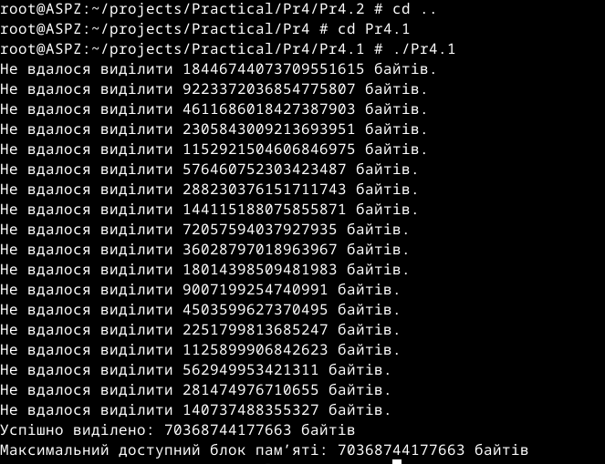
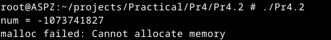

# Практична робота №4
Цей репозиторій cтворений для перегляду виконання практичної роботи №2 з дисципліни "Архітектура системного програмного забезпечення", виконане студентом Щур Р.І., групи ТВ-32.

## Завдання №1
Скільки пам’яті може виділити malloc(3) за один виклик?
Параметр malloc(3) є цілим числом типу даних size_t, тому логічно максимальне число, яке можна передати як параметр malloc(3), — це максимальне значення size_t на платформі (sizeof(size_t)). У 64-бітній Linux size_t становить 8 байтів, тобто 8 * 8 = 64 біти. Відповідно, максимальний обсяг пам’яті, який може бути виділений за один виклик malloc(3), дорівнює 2^64. Спробуйте запустити код на x86_64 та x86. Чому теоретично максимальний обсяг складає 8 ексабайт, а не 16?
## Виконання

Для вирішення задачі було використано бібліотеку stdint.h для отримання цілочисельних типів даних з точно визначеним розміром. Це зроблено тому, що time_t представляє час у вигляді кількості секунд, а кількість секунд зберігається як ціле число. Тому було оголошено дві змінні типу time_t, яким присвоюється максимальне значення 64 та 32-бітного цілого числа.Аналізуючи результат,видно, що розмір time_t на 64-бітній архітектурі значно більший за time_t на 32-бітній архітектурі.

## Завдання №2
Розгляньте сегменти у виконуваному файлі.
1. Скомпілюйте програму &quot;hello world&quot;, запустіть ls -l для
виконуваного файлу, щоб отримати його загальний розмір, і
запустіть size, щоб отримати розміри сегментів всередині нього.
2. Додайте оголошення глобального масиву із 1000 int,
перекомпілюйте й повторіть вимірювання. Зверніть увагу на
відмінності.
3. Тепер додайте початкове значення в оголошення масиву
(пам’ятайте, що C не змушує вас вказувати значення для кожного
елемента масиву в ініціалізаторі). Це перемістить масив із сегмента
BSS у сегмент даних. Повторіть вимірювання. Зверніть увагу на
різницю.
4. Тепер додайте оголошення великого масиву в локальну функцію.
Оголосіть другий великий локальний масив з ініціалізатором.
Повторіть вимірювання. Дані розташовуються всередині функцій,
залишаючись у виконуваному файлі? Яка різниця, якщо масив
ініціалізований чи ні?
5. Які зміни відбуваються з розмірами файлів і сегментів, якщо ви
компілюєте для налагодження? Для максимальної оптимізації?
Проаналізуйте результати, щоб переконатися, що:
## Виконання

Розміри сегментів програми,яка виводить повідомлення "Hello World!!!!"

Після додавання до програми глобального масиву із 1000 int,розмір сегменту неініціалізованих даних (bss) значно збільшився.

Після ініціалізації глобального масиву,сегмент даних збільшився,а значення розміру сегменту неініціалізованих даних (bss) повернулося до початкового.

Після оголошення неініціалізованого великого масиву в локальну функцію та ініціалізованого масиву помітна зміна розміру секції text

Використовуючи команди налагодження і максимальної оптимізації,зміни розмірів сегментів відсутні.

## Завдання №3
Скомпілюйте й запустіть тестову програму, щоб визначити приблизне
розташування стека у вашій системі.Знайдіть розташування сегментів даних і тексту, а також купи всередині
сегмента даних, оголосіть змінні, які будуть поміщені в ці сегменти, і виведіть їхні адреси.
Збільшіть розмір стека, викликавши функцію й оголосивши кілька
великих локальних масивів. Яка зараз адреса вершини стека?

## Виконання

Виходячи з результату виконання програми,як і очікувалось,адреси змінних стеку зменшуються з кожним рекурсивним викликом, вказуючи на те, що стек росте вниз у пам'яті.

## Завдання №4
Дослідити стек процесу або пригадати, як це робиться.

## Виконання

## Завдання №5
Відомо, що при виклику процедур і поверненні з них процесор
використовує стек.Чи можна в такій схемі обійтися без лічильника команд
(IP), використовуючи замість нього вершину стека? Обґрунтуйте свою
відповідь та наведіть приклади.

## Відповідь
Лічильник команд (IP) використовується для послідовного виконання коду. Стек не може замінити IP, оскільки він призначений для іншої мети і не містить інформації, необхідної для виконання коду.Припустимо, що стек використовується для керування адресами виконання. В такому випадку:
1)Перед виконанням кожної команди потрібно було б отримувати її адресу зі стека.
2)Після виконання кожної команди необхідно було б записувати адресу наступної команди
Тому використання стека замість лічильника команд (IP) є неефективним і складним.

## Завдання №6
Реалізуйте власний механізм розмітки пам’яті.

## Виконання

