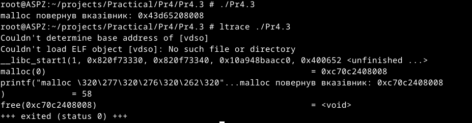
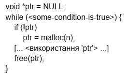
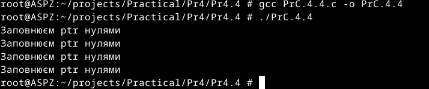
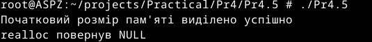
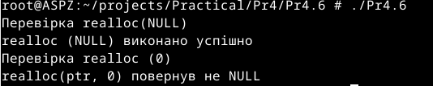
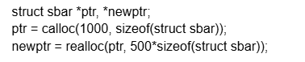
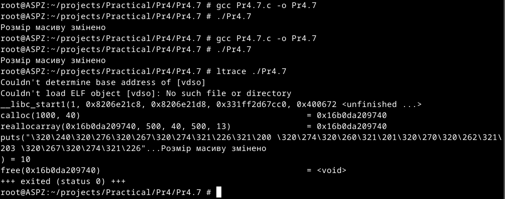
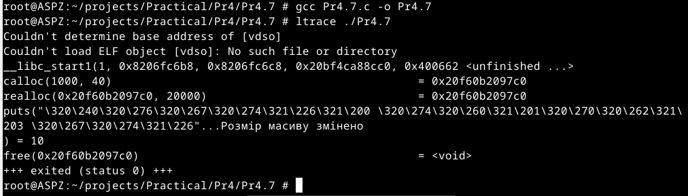
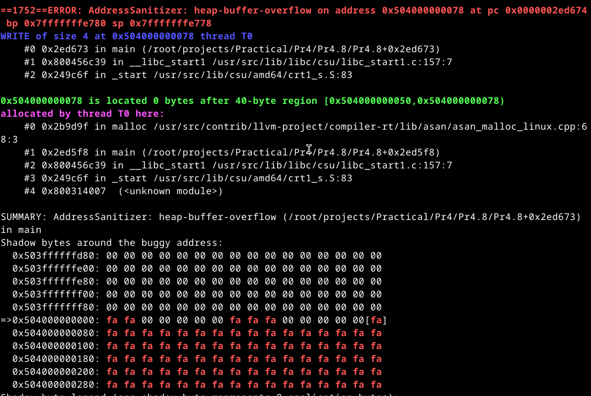

# Практична робота №4
Цей репозиторій cтворений для перегляду виконання практичної роботи №4 з дисципліни "Архітектура системного програмного забезпечення", виконане студентом Щур Р.І., групи ТВ-32.

## Завдання №1
Скільки пам’яті може виділити malloc(3) за один виклик?
Параметр malloc(3) є цілим числом типу даних size_t, тому логічно максимальне число, яке можна передати як параметр malloc(3), — це максимальне значення size_t на платформі (sizeof(size_t)). У 64-бітній Linux size_t становить 8 байтів, тобто 8 * 8 = 64 біти. Відповідно, максимальний обсяг пам’яті, який може бути виділений за один виклик malloc(3), дорівнює 2^64. Спробуйте запустити код на x86_64 та x86. Чому теоретично максимальний обсяг складає 8 ексабайт, а не 16?
## Виконання

Ліміт пам'яті залежить від обмежень віртуальної адресної пам'яті,тому навіть якщо size_t на  може зберігати значення 2^64, реальний обсяг пам'яті, який можна виділити , обмежений архітектурою та конфігурацією віртуальної адресної пам'яті операційної системи.

## Завдання №2
Що станеться, якщо передати malloc(3) від’ємний аргумент? Напишіть тестовий випадок, який обчислює кількість виділених байтів за формулою num = xa * xb. Що буде, якщо num оголошене як цілочисельна змінна зі знаком, а результат множення призведе до переповнення? Як себе поведе malloc(3)? Запустіть програму на x86_64 і x86.

## Виконання

Для виклику переповнення змінній було задано значення, яке перевищує INT_MAX. Програма на це відреагувала додаванням до мінімального значення, INT_MIN, різниці між результатом множення та INT_MAX. Саме тому результат множення вийшов від'ємним. Якщо ж передати це від'ємне значення malloc(3), то він не зможе виділити пам'ять і поверне NULL
## Завдання №3
Що станеться, якщо використати malloc(0)? Напишіть тестовий випадок, у якому malloc(3) повертає NULL або вказівник, що не є NULL, і який можна передати у free(). Відкомпілюйте та запустіть через ltrace. Поясніть поведінку програми.

## Виконання

Якщо викликати malloc(0), він може повернути NULL або вказівник. У моєму випадку malloc повернув вказівник, який можна передати у free(). Скомпілювавши та запустивши програму через ltrace, видно, як malloc повернув вказівник, як спрацювала функція free(), і те, що програма завершилась успішно.

## Завдання №4
Чи є помилки у такому коді?

## Виконання

Помилка початкового коду полягає у звільненні пам'яті в кожній ітерації циклу. Це призводить до того, що Free викликається для вже звільненої пам'яті. У виправленому коді я виніс Free за межі циклу, щоб уникнути цієї помилки.
## Завдання №5
Що станеться, якщо realloc(3) не зможе виділити пам’ять? Напишіть тестовий випадок, що демонструє цей сценарій.

## Відповідь

Для перевірки я спробував передати у realloc(3) максимальне значення size_t, в результаті realloc не вдалося змінити розмір пам'яті, і він повернув NULL.
## Завдання №6
Якщо realloc(3) викликати з NULL або розміром 0, що станеться? Напишіть тестовий випадок.

## Виконання

Результатом виклику realloc з NULL є виділення вказаного обсягу пам'яті, тобто функція спрацює як malloc. Якщо ж використати realloc з розміром 0, то вона мала б повернути NULL і звільнити попередньо виділену пам'ять, але в моєму випадку цього не сталося.
## Завдання №7
Перепишіть наступний код, використовуючи reallocarray(3):

Порівняйте результати виконання з використанням ltrace.

## Виконання

Переглядаючи результати виконання двох програм, в яких відмінність полягала у використанні в першому випадку reallocarray(3), а в другому — realloc, з використанням ltrace, я не побачив відмінностей.
## Завдання №8
Використайте sanitizers для перевірки витоків пам’яті

## Виконання

Використовуючи -fsanitize=address для програми, де навмисно створено витік пам'яті та переповнення буфера, спостерігається, що -fsanitize=address реагує лише на переповнення, але не на витік.
